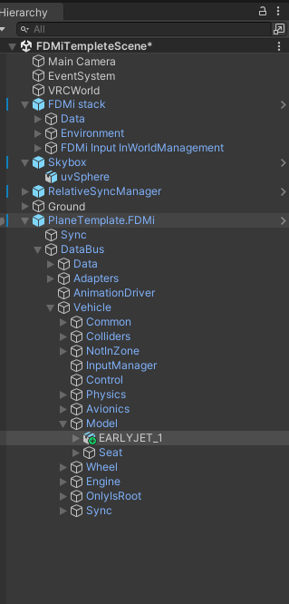
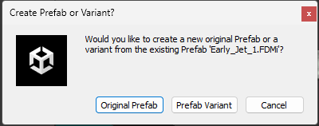
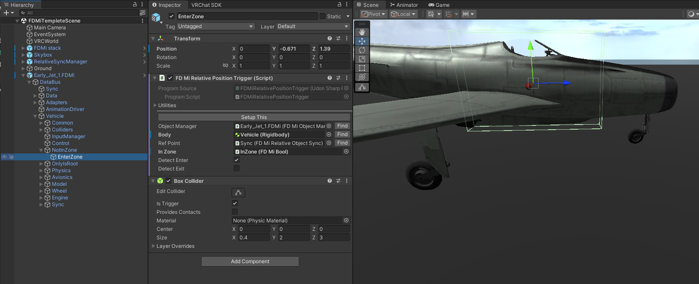
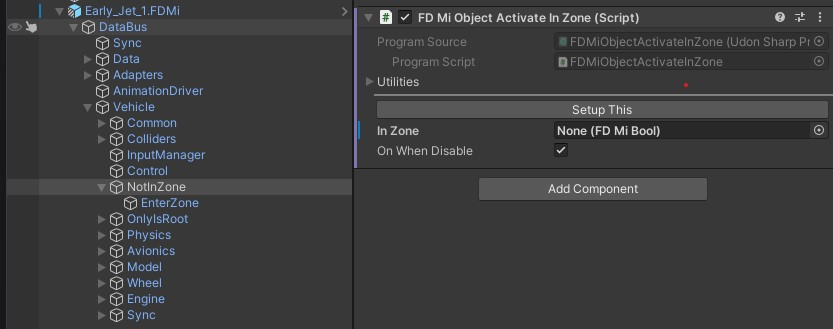
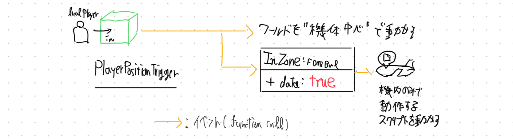
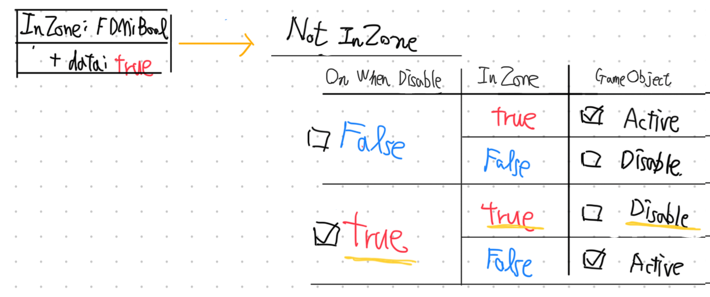
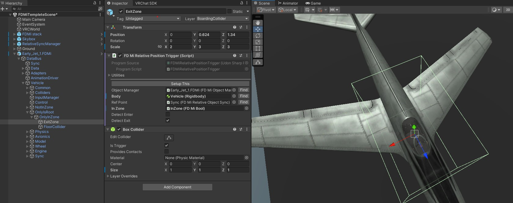
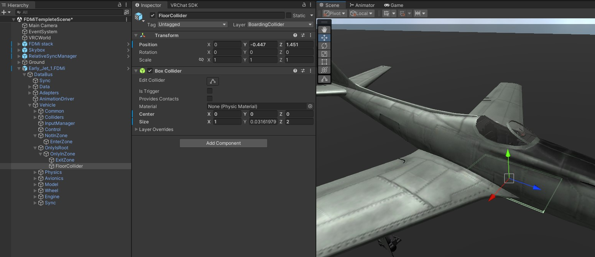
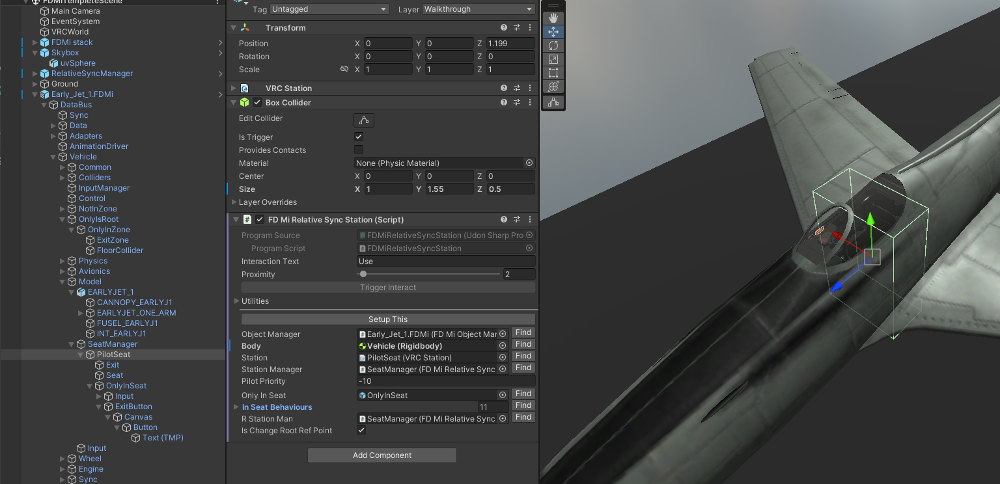
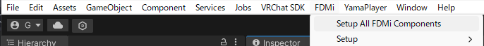

# 機体 3Dモデル・同期設定

:::warning

この節を始める前に、（[ワールドの設定](/tutorial%20-%20world/overview)）を必ず終わらせてください。

:::

## チェックリスト

- `Packages/FDMi - Example/Prefabs`から機体のテンプレート (`PlaneTemplate.FDMi`、または`Early_Jet_1.FDMi`)を用意する
-  `PlaneTemplate.FDMi/DataBus/Vehicle/Model/`に機体の3Dモデルが入っている
- `Databus/Vehicle/NotInZone/EnterZone`
    - コライダー
        - 位置・大きさが正しいか？
        - "Is Trigger" ⇒ ☑
    - `RelativeSyncPositionTrigger`の設定
        - "Detect Enter" ⇒ ☑ (有効)
        - "Detect Exit" ⇒　☐ (無効)
    - `Databus/Vehicle/NotInZone/`
        - `On When Disable`　 ⇒ ☑ (有効)
- `Databus/Vehicle/OnlyIsRoot/OnlyInZone/ExitZone`の設定
    - コライダー
        - 位置・大きさが正しいか？
        - "Is Trigger" ⇒ ☑
    - `RelativeSyncPositionTrigger`の設定
        - "Detect Enter" ⇒ ☐ (無効)
        - "Detect Exit" ⇒　☑ (有効)
    - `Databus/Vehicle/OnlyIsRoot/OnlyInZone/`
        - `On When Disable`　 ⇒ ☐ (無効)
- `Databus/Vechicle/Colliders`以下に、機体の外形コライダーを設置
- 椅子の設定(PilotSeat)
    - 配置を設定します。コライダーの判定を、`Box Collider`を調節して修正
    - `Box Collider`の`Is Trigger` ⇒　☑ (有効)
    -`Databus/Vechicle/Model/SeatManager/PilotSeat/Seat`の位置を椅子の座面あたりに設定
    - `Databus/Vechicle/Model/SeatManager/PilotSeat/Exit`の位置を、降りるときの位置に設定
    - `Databus/Vechicle/Model/SeatManager/PilotSeat/OnlyInSeat/ExitButton`の位置を調整
- `FDMi/Setup All FDMi Components`を押す。

## 1.3Dモデルの配置

まず、機体の3Dモデルを配置します。
このとき、下図の様に機体の脚が静止時の状態(タイヤがすべて水平な地面に接地した状態)を作成してください。

次に、プロジェクト内の `Packages/FDMi - Example/Prefabs` にある Prefab `PlaneTemplate.FDMi`を、モデルの子に入れます。
そのうえで
- TransformのPositionをすべて0にします
- TransformのRotationを以下のように調節します。
    - X軸（赤）を、機体の右手側
    - Y軸（緑）を、水平な地面に垂直
    - Z軸（青）を機体正面

ここで、一度 `PlaneTemplate.FDMi`を、3Dモデルの外に出します。このとき、`PlaneTemplate.FDMi`のRotationのX軸が0以外の場合、0を代入してください。
そのうえで、3Dモデルを `PlaneTemplate.FDMi/DataBus/Vehicle/Model/`の子にいれます。

:::warning

`PlaneTemplate.FDMi`を含む、飛行機の親GameObjectは、シーンの一番上の階層に配置してください。  
飛行機の親GameObjectとは、`FDMiObjectManager`を含むGameObjectを指します。

:::

ここまでできましたら、この時点で一度Prefab Variantを作成することを推奨します。
まず、`PlaneTemplate.FDMi`の名称を変更します。今回は`Early_Jet_1.FDMi`とします。
適切なフォルダ（通常 `/Assets`以下）にドラッグアンドドロップします。
このとき、選択肢が現れますので、`Original Prefab` または `Prefab Variant` を選択してください。

:::note

基本的にはFDMiのバージョン更新による不特定な仕様変化を避けるため、`Original Prefab`をお勧めします。  
本チュートリアルでは`Prefab Variant`で設定を進めます。  

:::

## 2. 同期の設定

機体の位置の同期は `Databus/Sync` が行います。これは後程でてくる`Setup All FDMi Components`で自動設定されますので、放っておいてください。  

:::info

FDMiにおける同期の仕組みを簡単に説明します。（読み飛ばしてかまいません）

- 飛行機の外にいるときは、普通のVRChatワールドとほぼ同じ感じです。
- 飛行機の中に入る（もしくは飛行機の椅子に座る）と、**Unity上の原点に飛行機を固定**し、**地面が動く**ようになります。
- 飛行機の外に出ると、元の状態に戻ります。

これらの”原点の管理”は `Databus/Sync`で行われています。
FDMiは、`DataBus/Sync`を含む`FDMiReferencePoint`が、Transformを動的に組み替え、原点の位置を常にLocalPlayerの近くに移動させます。
これにより、地球程度の大きさであれば、自由に移動ができます。

:::

さて、FDMiでは同期を含む様々な挙動に 「機体内にLocalPlayerが入った・機体からLocalPlayerが出た」判定が重要になります。  
その判定には`RelativeSyncPositionTrigger`を使用します。

`RelativeSyncPositionTrigger`は、今回二か所にあります。

- `Databus/Vehicle/NotInZone/EnterZone`
- `Databus/Vehicle/OnlyIsRoot/OnlyInZone/ExitZone`

それぞれについて見ていきます

### 2.1 `Databus/Vehicle/NotInZone/EnterZone`(機内に"入る")

`Databus/Vehicle/NotInZone/EnterZone`を見ていきます。  

`PlaneTemplate.FDMi`から機体を制作している場合、まずコライダーの位置がずれているはずです。いい感じに修正してください。(Transformを動かしてかまいません。)
今回のような単座機では、判定は極小でかまいません。(逆に旅客機や爆撃機の場合、大き目にとると良いでしょう)。

更に、`Databus/Vehicle/NotInZone/EnterZone`のコライダー "Is Trigger" が ☑　になっていることを確認して下さい。

:::tip

Box ColliderのComponentの中身が見えないときは、一度ほかのGameObjectを選択後、再度`Databus/Vehicle/NotInZone/EnterZone`を選択してください。

:::

次に、`RelativeSyncPositionTrigger`の設定を確認して下さい
- "Detect Enter" ⇒ ☑ (有効)
- "Detect Exit" ⇒　☐ (無効)

次に、一つ上の階層、`Databus/Vehicle/NotInZone/`にある`FDMiObjectActivateInZone`ついて、以下の設定を確認してください。
- `On When Disable`　 ⇒ ☑ (有効)

:::tip

`PlaneTemplate.FDMi`から機体を制作している場合、`InZone`の項目は設定されていませんが、後から自動で設定されます。

:::

:::info

`RelativeSyncPositionTrigger`は、OnTriggerEnter/OnTriggerExitにより、Box Colliderからの出入りを取得します。
Detect Enterが☑(有効)なときは、以下のような動作を行います。

- ワールドの原点を飛行機中心にする
- `InZone = true` を設定する。
    - InZoneが自身の変更を検知し、あらかじめ登録されたGameObjectを呼び出す。
        - InZoneは”LocalPlayerが機内にいる”状態を示す。

また、`FDMiObjectActivateInZone`は、`InZone`の情報を基に、自身のGameObjectを入切します。
これにより、”飛行機の中にいるときのみ見える/動く”と”飛行機の外にいるときのみ見える/動く”を実現しています。

:::

### 2.2 `Databus/Vehicle/OnlyIsRoot/OnlyInZone/ExitZone`

2.1と同様に、今度は”機体から出た”を検出するコライダーを作ります。`Databus/Vehicle/OnlyIsRoot/OnlyInZone/ExitZone`を見ていきます。  

まずコライダーの位置をいい感じに修正してください。(Transformを動かしてかまいません。)
`ExitZone`では、必ず判定を、機内の椅子・歩ける箇所を全て含む、大きな囲いで囲ってください。

更に、`Databus/Vehicle/OnlyIsRoot/OnlyInZone/ExitZone`のコライダー "Is Trigger" が ☑　になっていることを確認して下さい。

次に、`RelativeSyncPositionTrigger`の設定を確認して下さい。  
※ 2.1と反対のセッティングです！

- "Detect Enter" ⇒ ☐ (無効)
- "Detect Exit" ⇒　☑ (有効)

次に、一つ上の階層、`Databus/Vehicle/OnlyIsRoot/OnlyInZone`にある`FDMiObjectActivateInZone`ついて、以下の設定を確認してください。
- `On When Disable`　 ⇒ ☐ (無効)

:::info

`Databus/Vehicle/OnlyIsRoot`にある`FDMiRelativeSyncOnlyIsRoot`は、機内にいるとき、ワールドの中心に機体を固定するために使用されます。
`Databus/Vehicle/OnlyIsRoot`の直下には、`OnlyInZone`以外を入れないでください。

スクリプト実行時、`Databus/Vehicle/Model`にある`FDMiRelativeSyncModelTransform`と`FDMiRelativeSyncOnlyIsRoot`は協調して動作します。

- `Start()`のタイミングで、`FDMiRelativeSyncOnlyIsRoot`は自身を`Databus/Vehicle`の外に出し、ワールド原点に固定します。
- `InZone=true`になると、`FDMiRelativeSyncModelTransform`は自身を`FDMiRelativeSyncOnlyIsRoot`の子に設定します。
- `InZone=false`になると、`FDMiRelativeSyncModelTransform`は自身を`Databus/Vehicle`の子に設定します。

機内にものを配置したいときは、`Databus/Vehicle/Model`以下に置くことをお勧めします。

:::

### 2.3 機内の床コライダー

ここで、`Databus/Vehicle/OnlyIsRoot/OnlyInZone/FloorCollider`をみてみます。
先程の`OnlyInZone`の機能を用い、機内だけで見える床を設定します。
機内で、人を立たせたい位置にコライダーを配置してください。

:::tip

`Databus/Vehicle/OnlyIsRoot/OnlyInZone/FloorCollider`のLayerは"BoardingCollider"に設定します。  
設定されていない場合、Unityの上部メニュー "FDMi/Setup/Setup Layer"をクリックしてください。

:::

:::tip

FDMi機は、`InZone`の判定にあれば、制限なく何人でも乗れてしまいます。
ゲーム性に問題が生じる場合、床コライダー自体を消してしまいましょう。

:::

### 2.4 機体外形コライダー

2.3は”機内”のときだけ有効になるコライダーです。機外の、機体同士の当たり判定などは、`Databus/Vechicle/Colliders`以下にコライダーを配置して設定してください。
LayerはWalkThroughを推奨します。

## 3. 椅子の配置

次に、機内で座れる”椅子”を配置します。
`Databus/Vechicle/Model/SeatManager/PilotSeat`を見てください。

- 配置を設定します。コライダーの判定を、`Box Collider`を調節して修正してください。
- `Box Collider`の`Is Trigger` ⇒　☑ (有効)
- 座る位置を設定します。`Databus/Vechicle/Model/SeatManager/PilotSeat/Seat`の位置を、座面あたりに設定します。
- 降りる際の位置を設定します。`Databus/Vechicle/Model/SeatManager/PilotSeat/Exit`の位置を、降りるときの位置に設定します。
- 椅子から降りるボタンを設定します。`Databus/Vechicle/Model/SeatManager/PilotSeat/OnlyInSeat/ExitButton`の位置を調整します。

:::tip

パイロット以外の椅子を増やしたいときは、`Databus/Vechicle/Model/SeatManager`以下に`PilotSeat`をコピーしてください。  
その際、`OnlyInSeat`以下の`Input`の項目は、必ずメンテナンスしてください。

:::

## 4. `Setup All FDMi Components`

ここまでの設定が終わったら、上部メニューの`FDMi/Setup All FDMi Components`を押します。
自動でワールド・機体の設定を行います。

上手くいけたら、`DataBus/Data`以下にたくさんのGameObjectが生成されているはずです。これらは、自動生成されたFDMiDataです。  
`DataBus/Data`の中には`InZone`もあるはずです。2.2で説明したInZoneがあります。  
試しに、`Databus/Vehicle/NotInZone`の`InZone`項目を空にした後、`FDMi/Setup All FDMi Components`を押してみてください。  
自動で`InZone`が割り振られているはずです。

`Setup All FDMi Components`は、可能な限り自動で設定を行います。 以下の場合は一度押してください。

- 新しく機体等を配置したとき。もしくは設定を変更したとき。
- 機体が上手く動かないとき