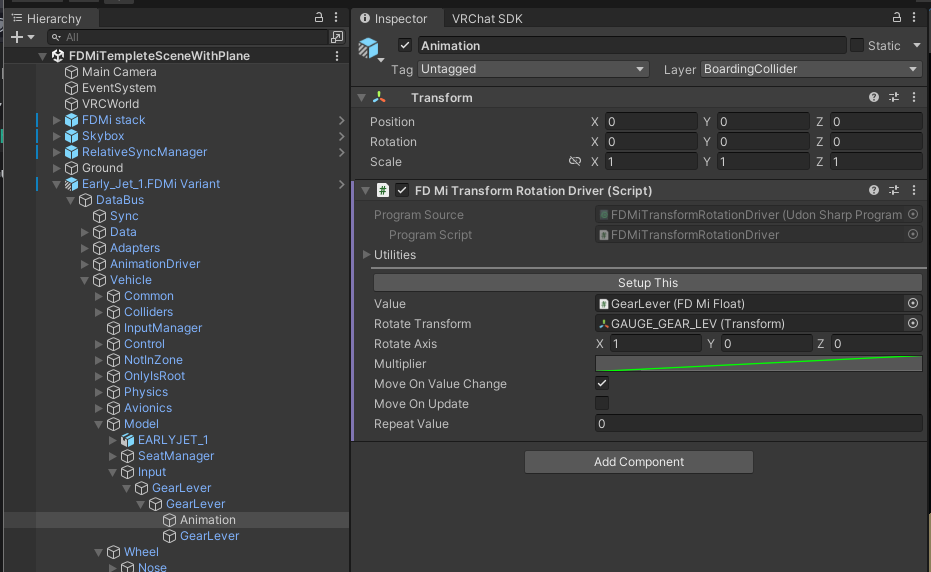
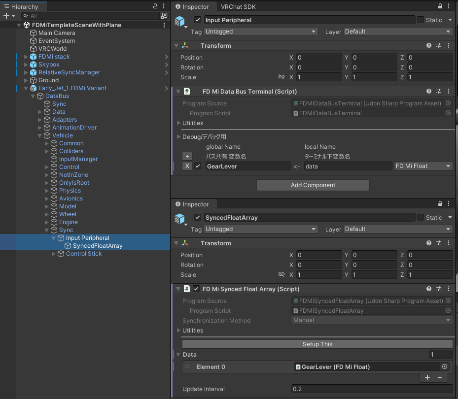

# 機体 インプット/アニメーション 設定
:::warning
この節を始める前に、（[機体 3Dモデル・同期設定](/tutorial%20-%20plane/installation)）を必ず終わらせてください。  
もしくは、`FDMi - Example`パッケージ中に含まれるサンプル例を開いて確認して下さい。
:::

:::tip
サンプル機に同様の設定を施してあります。お手元に用意して、参考にしてください。  
以下の記事内容は、**まず文字は見ず、記事中の図とサンプルをみることをお勧めします。**
:::

## 1.概要
この章では、FDMiにおける「入力」と「出力」、「FDMiData」の設定方法を説明します。
  

### 入力 / Input
VRやキーボード、もしくは機体自体（オートパイロットなど）や同期による、FDMiへの値の変更を、まとめて「入力」と定義します。
入力は、`FDMiData`(通常はFDMiFloat)に、「変化量(Value)」と「変化したことを示す通知(Event)」を送信します。

### 出力 / Output
機体の物理やアニメーション・Transformの移動などを指します。
出力には、以下の２通りの動作パターンが挙げられます。
- `Update()`, `FixedUpdate()`毎に動作する
- `FDMiData`が変化した際に、FDMiDataから送信される「変化したことを示す通知(Event)」をもらい、そのタイミングで動作する

### FDMiData
FDMiDataは「値(Value)」と「変更イベント(Event)」を管理します。  
FDMiDataは「値を保持する」機構、とも言えます。
- 「値(Value)」: 入力により入力された値を保持します。出力は値の読み取りができます。
- 「変更イベント(Event)」: 「入力」が値を変化させた際、「出力」から「値が変更した」ことを知らせます。

この設計を行うことで、例えば、一つの入力結果（レバーの操作）を複数の出力に伝えたり、複数の入力結果（例えばVRとキーボード）を一つの入力結果として保持できるようになります。  
また、この設計では、ある入力や出力のみのテストの際、仮置きの`FDMiData`を用いることで、単機能テストが行いやすくなります。

## 2 設定方法

以下、例として、ギアレバー及び脚の展開アニメーションを設定します。
今回は、VRのコントローラを上下に動かすと、ギアレバーが動作するように設定します。

### 2.1 理想状態

- VR上で、ギアレバーに手を重ね「Grab」を行う
  - ギアレバーの上下動に関する`FDMiData`の値が変化する
  - `FDMiData`の値に応じ、ギアレバーの3Dモデルが動作する
  - `FDMiData`の値に応じ、脚の格納アニメーションが動作する

### 2.2 初期設定

まず、VRにおける入力を、FDMiが受け取るための設定を行います。

1. `FDMiFingerTracker`の準備

まず、`FDMiFingerTracker`が準備できていることを確認します。
シーン中`FDMi stack/FDMi Input InWorldManagement`の中に`L`,`R`と名前のついた`FDMiFingerTracker`のComponentがあることを確認してください。

:::warning
もし存在しない場合、`FDMi stack`を`Packages/FDMi - Example/Prefabs`から配置してください。
詳細は[ワールドの設定](/tutorial%20-%20world/overview)にあります。
:::

2. `FDMiInputManager`の配置

対象としたい飛行機(`FDMiObjectManager`)の子に、`FDMiInputManager`のComponentが設定されたGameObjectを配置します。

### 2.3 VRによる入力系の配置

では、VRの入力を配置します。ここで、入力の仕組みを説明します。

1. `FDMiInputZone`を、入力対象と一致する位置に用意します。`FDMiInputZone`には、1:1対応で`FDMiInputPage`が紐づいています。
2. `FDMiInputZone`の付近でコントローラをGrabすると、`FDMiInputPage`が呼び出されます。
`FDMiInputPage`は、配下の`FDMiInputAddon`(今回は`FDMiLeverInput`)を起動します。
3. `FDMiInputAddon`は、そのときの手の位置・回転・ボタンの状態を読み取り、結果を`FDMiData`(今回は`FDMiFloat`)に渡します。

以下、各項目の設定を説明します。

#### 2.3.1 `FDMiInputPage` 

まず、`FDMiInputPage`を配置します。
`Vechicle/Model`の子に配置します。ほかの入力系を設定する事を踏まえ、今回は`Vechicle/Model/Input/GearLever`に配置しました。
内部の値は後程の操作で自動設定されます。

#### 2.3.2 `FDMiInputZone` 
FDMiInputZoneを設置します。
今回は、（最終的に動作する）ギアレバーに追従させるため、ギアレバーのボーンの子にGameObjectを作成し配置します。

- 上図の様に、`Is Trigger`を有効化した`Collier`と同じGameObjectに`FDMiInputZone`を配置します。
- `InputPage`に、先程配置した`GearLever`の`FDMiInputPage`を設定します。
- Hilight Objectには、下図の様な手を近づけた際にハイライトとして光らせたいGameObjectを設定します。  
今回の場合、`FDMiInputZone`の子に`Sphere`の3Dモデルを配置し、GameObjectをfalseにしています。  
モデルの制作時、レバー毎にGameObjectを分割すると、レバーにHilightをつけられます。

#### 2.3.3 `FDMiLeverInput` (+ `FDMiDataBusTerminal`)
次に、レバーによる動作自体を設定していきます。
まず、`Vechicle/Model/Input/GearLever`の子に、`FDMiDataBusTerminal`を配置します。
そして、その子に`FDMiLeverInput`を配置します。

`FDMiLeverInput`の`LeverOutput`には`FDMiFloat`が入ります。`FDMiFloat`は`FDMiData`の一種で、float値を格納します。  
`FDMiLeverInput`は`LeverOutput`の値を変更するとともに、変更イベントを`LeverOutput`に発行します。

以下、`FDMiLeverInput`の各項目を設定していきます。

- まず、LeverInputのTransformの位置を”レバーの根本”に持ってきてください。 
Leverを手で回したり(Rotate)、ひねったり(Twist)する動作の際の、レバーの根本を示します。
- `Control Type`と`Lever Axis`を設定します。
  - `Pull`: **平行移動**による入力量を指します。Grabをしながら`Lever Axis`で設定した方向(このTransformの矢印)に手を動かした量を、`Lever Output`に加算します。単位は1/mです。
  
  - `Rotate`: Transformを原点とした、**回転**による入力量を指します。現在のTransformをレバーの支点、`Lever Axis`を回転軸とした回転移動量を`Lever Output`に加算します。単位は1/°です。
  - `Twist`: **ひねり**による入力量を指します。Grab中のコントローラー自体の回転量から、`Lever Axis`で設定した軸周りの回転量を取り出し、`Lever Output`に加算します。単位は1/°です。
- `multplier`,`min`,`max`を設定します。
  - Grabをすると、`LeverOutput=Clamp(LeverOutput + (変化量)* multiplier,min,max)`の結果を`LeverOutput`に格納します。  
  今回は以下の設定にします。
  - `multplier`:1/60   60°回転させたら「1」になるよう、を代入します。
  - `min`: 0
  - `max`: 1

- `Detents` 手を離した際、`Detents`に最も近い値に`LeverOutput`を設定します。  
`Detents`に何も設定しなければ、この動作は発生せず、最後に手を離した位置がレバーの位置になります。  
今回は、ギアレバーの結果なので`[0,1]`を設定しています。

#### 2.3.4 `FDMiData`(`FDMiDataBusTerminal`を使用) 

最後に、FDMiDataを設定します。入力結果の値を保存するため,`FDMiLeverInput`の`LeverOutput`に`FDMiFloat`を配置します。

ここで、そのまま行ってもよいのですが、FDMiでは大量の`FDMiData`を配線が必要になる関係上、無秩序に`FDMiFloat`を増やすと大変なことになります。（なりました。）

そこで、`FDMiData`の配置を自動化する、`FDMiDataBus`と`FDMiDataBusTerminal`を使用します。

さて、2.3.3では`Vechicle/Model/Input/GearLever/GearLever`(`FDMiLeverInput`の親)に`FDMiDataBusTerminal`を配置したかと思います。`FDMiDataBusTerminal`「＋」ボタンを押して、以下を追加します。

- チェックボックス：☑(有効)
    - ☑(有効)：この機体全体に設定を波及させます。
    - ☐(無効)：この`FDMiDataBusTerminal`の子のみで使用する変数として扱います。
- `global Name`: "GearLever"
    - 機体全体で、この変数を指す名前として使用します。`FDMiDataBusTerminal`は、ここで設定した名前をもとに、"GearLever"を探し（無ければ自動生成し）ます。
- `local Name`: "LeverOutput"
    - `FDMiDataBusTerminal`の子にあるComponentの、`FDMiData`を代入する項目の変数名が`local Name`と一致した際、`Global Name`で紐づいた`FDMiData`を自動で代入します。
- 変数型: `FDMiFloat`
    - 変数型を指定します。`local Name`の示す代入先に応じた`FDMiData`の型を選択してください。
    今回、`LeverOutput`は`FDMiFloat`を代入すべき項目ですので、`FDMiFloat`を選択します。  

#### 2.3.5 自動設定

ここまで設定したら、Unity上部のメニューから`FDMi/Setup All FDMi Components`を選択してください。
自動設定すべき場所に、変数が自動配置されます。

:::note
自動配置される場所は、以下の通りです。
- FDMiData型(FDMiBool,FDMiFloat, FDMiVector3, FDMiSyncedFloat等)が代入される箇所
- 変数の横に"Find"のボタンがある箇所
:::

### 2.4 出力：ギアレバーの動作(`FDMiTransformRotationDriver`)

入力の結果を、出力に適用してみましょう。
まず、ギアレバーを動作させてみます。`Vechicle/Model/Input/GearLever`の子に、`FDMiTransformRotationDriver`を含むGameObjectを作成します。

`FDMiTransformRotationDriver`は、`FDMiData`に応じ、Transformを回転させます。

- `Value`： のちほど`FDMiDataBusTerminal`で設定されます。
- `RotateTransform`: 回転させたいTransformを選択します。今回はギアレバーに紐づいたボーンを選択しています。
- `RotateAxis`: 回転させたい軸を選択します。軸は`RotateTransform`の、ローカルの軸です。
- `Multiplier`:　`Value`の`FDMiFloat`が持つ値に対し、`RotateTransform`を何°回転させたいかを設定します。
- `repeatValue`:　`Value`の値に対し、繰り返しを設定します。計器の針など、一定の値(100ftとか)で0に戻したいときに使用します。

また、以下を設定します。以下は、負荷などを考えて使用してください。
- `moveOnValueChange`: ☑(有効)
    - FDMiDataが「値の変更に伴うイベント」を受け取るたびに、Transformを回転させます
    - 毎フレーム動作すると`moveOnUpdate`より重いですが、数分に一回呼ばれる程度であればこちらの方が軽量です。
- `moveOnUpdate`: ☐(無効)
    - Update毎にTransformを回転させます。
    - 毎フレーム動作するもの（計器など）では、`moveOnValueChange`より軽くなります。

次に、`FDMiDataBusTerminal`に、以下を追加します。

- チェックボックス：☑(有効)
- `global Name`: "GearLever"
- `local Name`: "Value"
- 変数型: `FDMiFloat`

ここまで設定されていれば、以下の状態になるはずです。
ここでUnity上部メニューから`FDMi/Setup All FDMi Components`を選択し、自動設定を実行してください。

ここまでできたら、VRChatでワールドに入り、椅子に座り、レバーを握ってみてください。
正常に設定できていれば、手の動きに応じてレバーが動作するはずです。
上手くいかないときは,`FDMiLeverInput`の`Muiltiplier`、および`FDMiTransformRotationDriver`の`Muiltiplier`を確認してください。

### 2.5 出力：ギア格納・展開(`FDMiAnimatorDriver`)
:::warning
ここでは、「見た目」の変化のみを設定します。WheelColliderの設定は別で行います。
:::

次に、ギアの格納アニメーションを作成してみます。  
まず、ギアの格納をAnimatorに設定します。Animatorの設定については、モデル差がありますので詳細は割愛します。
今回は、以下の様なAnimatorを作成しました。
- パラメータ`gear`の値に応じて、ギアが展開する
　- 0: 展開状態
  - 1: 格納状態

ここで、`FDMiData`の値を用いてAnimatorのパラメータを変化させていきます。
ただし、`GearLever`の値そのままだと、脚の格納が一瞬で終わってしまうため、「`GearLever`を1にしたら、ゆっくり格納される」挙動を作成していきます。

完成形は以下の図に示す通りです。
`GearLever`の値にディレイ(遅れ)をかけたFDMiFloat、`GearRetract`を用意し、その値をAnimatorに書き込みます。

#### 2.5.1 ディレイ(FDMiFloatMixer)

まず、`GearLever`の値にディレイをかけます。これには`FDMiFloatMixer`を使用します。
今回は`Vehicle/Control/Gear`の子に`FDMiFloatMixer`を作成します。

各項目は以下の通り設定します。

- `output`: 出力先の`FDMiFloat`を設定します。
  - 今回は`Vehicle/Control/Gear`に`FDMiDataBusTermianl`を置き、自動設定します。
- `data`: 入力の`FDMiFloat`を設定します。
  - `Output`は、各`data`の**総和**に対しディレイやOutput Curveをかけた結果が代入されます。
  - 今回は`Vehicle/Control/Gear`に`FDMiDataBusTermianl`を置き、自動設定します。
- `T`: 0.2 = 1/5(s)
  - 入力に対する出力の遅れを定義します。
  - 今回は、5秒かけて脚を展開してほしいため、1/5=0.2を設定します
- `outputCurve`: 入力の総和に対し、出力のマッピングを行います。横軸が`data`の総和・縦軸が`Output`になります
  - 今回は`data`の総和と`Output`が1:1対応になるような設定にします
- `useUpdate`:　☐（無効）
    - Update()毎に`Output`を変更します
- `useOnChange`:　☑(有効)
    -  各`data`が変更される毎に`Output`を変更します

次に、`Vehicle/Control/Gear`に`FDMiDataBusTermianl`を配置します。

- `GearRetract`:出力です。です。`FDMiFloatMixer`の`output`に代入されるよう設定します。
- `GearLever`: 入力です。`FDMiFloatMixer`の`data`に代入されるよう設定します。

:::note
`FDMiData`(`FDMiFloat`等)の配列に、`FDMiDataBusTermianl`から代入したいときは、配列の順に、配列名を書いてください。
(複数個の`FDMiData`を、`FDMiDataBusTerminal`から代入することができます。)
:::

:::tip
`local Name`に入れる名称の正しい綴り（大文字/小文字）などがわからないときは、代入したい項目を**右クリックし、`Copy Property Path`**を行えば、正式名称をクリップボードにコピーできます。

:::

#### 2.5.2 ギア格納・展開(`FDMiAnimatorDriver`)

次に、Animatorを動かしていきます。  
まず、Animatorを設定します。今回は`Vehicle/Model`に`Animator`コンポーネントを配置しました。
今回は、"gear"パラメータに応じて、脚の位置を稼働させるAnimationが配置されています。

それでは、`Vechicle`と同じ階層にある`AnimationDriver`以下に、"gear"パラメータを変化させる`FDMiAnimatorDriver`を設定します。

- `AnimatorDriver/Gear`に`FDMiDataBusTerminal`を配置します。
  - `GearRetract`を、配下の`Input`に自動設定されるよう設定します。
- `AnimatorDriver/Gear`の子に`FDMiAnimatorDriver`を配置します。
  - `Input`: 入力です。`FDMiDataBusTerminal`から設定されます。
  - `Animator`: パラメータを変更させたい対象のAnimatorを設定します。今回は`Vehicle/Model`を選択しています。
  - `Paramator`: `Animator`内の、値を変化させたいパラメータに対応する文字列を記入します。今回は"gear"です。
  - `outputValue`: 横軸`Input`対し、縦軸`Paramator`の値をどのように変化させるかを設定します

ここまでできたら、Unity上部メニューから`FDMi/Setup All FDMi Components`を選択し、自動設定を実行してください。
VRChat上で、ギアレバーを動かすと、脚が格納するようになります。

## 3. 同期の設定

このままでは、脚の格納・展開状態を、自分以外の人に伝えられないので、同期を設定します。
同期の設定方法は２通りあります。
- `FDMiFloat`を`FDMiSyncedFloat`に置き換える
- `FDMiSynedFloatArray`を使用する

今回は後者を使用します。  
前者に対する後者のメリットは、同期したい/したくないを後から変更・管理しやすい点です。  
(`FDMiSyncedFloat`を使うと、何が同期対象なのか分かりづらくなってしまう、それだけです。好みで使ってください。)

今回は、`GearLever`を同期対象とします。直接的な展開・格納状態(`GearRetract`)は同期せず各個で計算する形にします。

- `Vehicle/Sync/InputPeripheral`に`FDMiDatabusTerminal`を配置します。
  - `GearLever`を`FDMiDatabusTerminal`配下の`data`に自動設定されるよう設定します。
- `Vehicle/Sync/InputPeripheral`の子に`FDMiSyncedFloatArray`を配置します。

ここまでできたら、Unity上部メニューから`FDMi/Setup All FDMi Components`を選択し、自動設定を実行してください。
これで、脚の格納状態が同期されるようになります。

## 4.アニメーション　デバッグ

ここまでで、アニメーションが設定されたかどうかのテストを**簡潔に**行う方法を解説します。
`FDMi/Setup All FDMi Components`を押した後、Unity上でPlayモードにします。

1. `Vehicle/Data`（自動生成された`FDMiData`）から`GearLever`を探します。
2. `FDMiFloat`の`Data`の数字を"0"⇒"1"にしてみます。
3. `ClientSimUdonHelper`の`Run Custom Event`から"trigger"を押します
4. ギアレバーの動作と、ギアの格納をチェックします。

ここで、ギアレバーの位置・回転量がずれていたり、ギア格納アニメーションの速度見てみます。  
おかしい場合は、各項目にもどって、パラメータを確認します。