# 機体 物理挙動 設定
:::warning
この節を始める前に、（[機体 3Dモデル・同期設定](/tutorial%20-%20plane/installation)）を必ず終わらせてください。  
もしくは、`FDMi - Example`パッケージ中に含まれるサンプル例を開いて確認して下さい。
:::

:::note
この章で説明している内容の根底は、航空力学の知識を要するものです。  
(FDMiは物理挙動になるべく忠実にすることで、”パラメータ調節”の簡素化を目指しています。その代償として物理的に正しく設定しないとうまく飛びません。)  
現時点の本項では「設定したけど飛ばない！」「チューニングの仕方がわからない！」への対処法は記載できていません。
上手くいかない場合は、現状は製作者(本ページフッターに記載)までお問い合わせいただければ幸いです。

機体のチューニングの参考文献として、以下が非常に参考になります。是非ご活用ください。（随時追加予定/以下は別頁分離予定）

#### mtk_birdman　https://mtkbirdman.com
日本語資料の中で特にわかりやすい。

#### UIUC Applied Aerodynamics Group https://m-selig.ae.illinois.edu
- Incomplete Guide to Airfoil Usage https://m-selig.ae.illinois.edu/ads/aircraft.html
    - 代表的な機体の翼型が記載されています
- UIUC Low-Speed Airfoil Tests https://m-selig.ae.illinois.edu/uiuc_lsat.html
    - 代表的な翼型の２次元翼特性(Cl-Alpha, Cd-Alpha)が記載されています。
    - ただし、低速風洞データでRe数が低いので、高速機に適用する際はDATCOMの理論値の方が適当かも。

:::

:::tip
サンプル機に同様の設定を施してあります。お手元に用意して、参考にしてください。  
以下の記事内容は、**まず文字は見ず、記事中の図とサンプルをみることをお勧めします。**
:::

## 概要
この章では、FDMiにおける物理挙動の設定方法を説明します。

流れとしては以下の通りです。
1. タイヤ
2. 位置・大気・風速(ADIRU)
3. エンジン
4. 主翼
5. 尾翼
6. 機体重量・重心・モーメント
7. 胴体抵抗
8. 操縦系

以下の設定は、基本`Vehicle/Physics`以下に行います。  
`Vehicle/Physics`には、`FDMiObjectActivatorIsPilot`を配置してあります。 
これにより、**機体の同期オーナーが、機内にいるときのみ**物理演算が行われるようになります。

## 1. タイヤ

まず、機体を支える”タイヤ”をセットアップします。  
タイヤ自体はUnity標準の`WheelCollider`を使用します。追加で、タイヤに関する制御を行う`FDMiWheel`を設定します。
:::tip
`WheelCollider`は、(内部実装が４輪前提？なのか)4つ丁度配置すると計算が良い感じになります。
ほとんどの機体の場合、前輪に２つ、主脚に２つにすればよいはずです。
:::
`FDMiWheel`と`WheelCollider`は、サンプル例を参考に、以下の通り設定します。

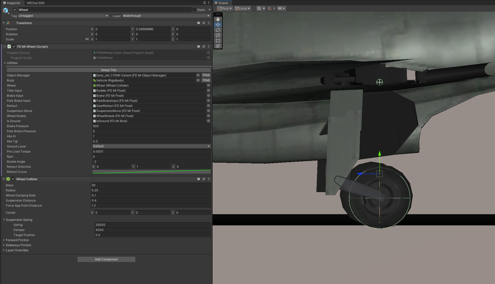

### WheelCollider

- WheelMass
    - ばね下の動きを示します。タイヤ＋サスペンションの重みとして、少し重めに設定してください。
- WheelDampingRate
    - タイヤの慣性です。タイヤの抵抗はここで調整してください。
- ForceAppPointDistance
    - タイヤが力を伝える位置です。タイヤの接地面より上なら基本的に問題ないらしい？
- Suspension Spring
    - 機体を地面にたたきつけて、いい感じの値を割り出してください。
        - 「Play（上側再生ボタン）」⇒「機体の椅子に座った状態で一時停止」⇒「Rigidbodyのコンポーネントを上側に移動」で、機体を地面から浮かせられます
    - おおむね、機体重量に比例するはずです。

### FDMiWheel
- TillerInput
    - タイヤを左右に傾ける入力です
    - タイヤの角度は`rotateAngle` * `TillerInput.data`(°)、右向き正で計算します
- BrakeInput
    - タイヤのブレーキ入力です
    - WheelColliderのBrakeTorqueとして、`brakePressure`*`brakePressure.data`を代入します
- ParkBrakeInput
    - パーキングブレーキの入力です
    - WheelColliderのBrakeTorqueとして、`parkBrakePressure`*`ParkBrakeInput.data`を代入します
- Retract
    - 脚の格納です
    - retractDirectionの方向に、`retractCurve(Retract.data)`分Transformを移動させます
- absKi,absTgt
    - タイヤのABS機能の設定値です。十分大きな値が入っていれば、基本無問題です。
- preLoadTorque
    - タイヤに少しだけ前進方向のトルクを与えます。かならず正方向に微小な値を入力してください。
    - これが0のとき、機体は前進できません。

## 2. 位置・大気・風速(ADIRU)

機体自身の置かれている状況を計算します。ここで計算されたデータを基に、FDMiは空気力の計算を行います。

※※ TODO （ADIRUの概念図）　※※

ここで取り扱うデータは、一般的な航空機のADIRU(Air Data/ Inertial Reference Unit)に相当するものになります。
ただし、実機におけるADIRUは「センシングしたデータから、機体の状況を把握する」ものなのに対し、FDMiのそれは「機体の状況に関するデータを”生成”する」ものであることに注意してください。

ここでは、サンプル機の`Databus/Vehicle/Avionics/ADIRU`を流用する形とします。
ただし、ADIRUは`FDMiObjectActivateInZone`の子にして、機内のみで動作させるようにします。
(新しい機体を作成するときは、`Databus/Vehicle/Avionics`を丸ごと、新機体の`Databus/Vehicle`の下に置きます)  
※下図の項目は設定を**サンプル機そのままにして**導入してください
 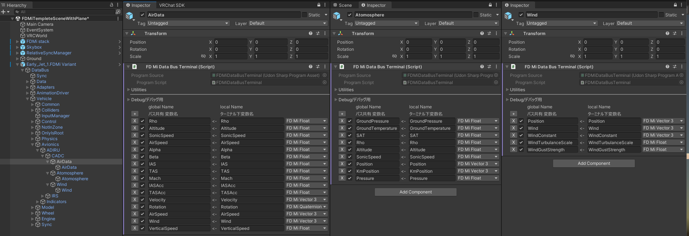

次に、`Databus/Adapters`を設定します。これは、機体外で設定された、大気（地面の気圧・気温・風速）を機体に適用するものです。（機体の外にある`FDMiData`の情報を、機内に接続します。）
`Databus/Adapters/FDMiStack`を、新機体にコピーしてください。
 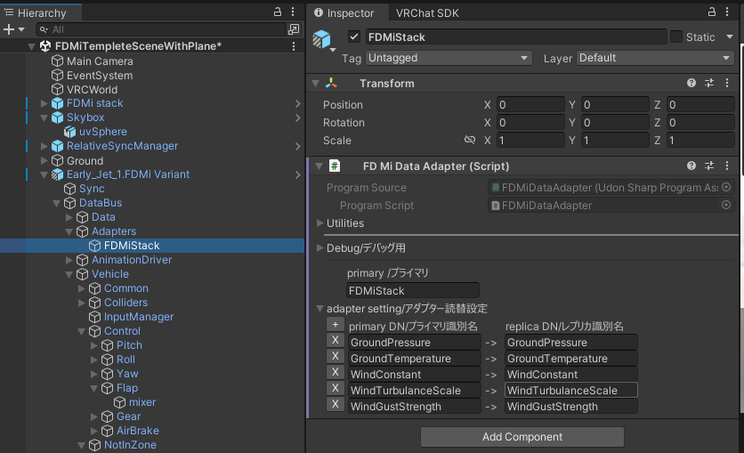

## 3. エンジン

エンジンを設定します。
今回は、ジェットエンジンを設定します。
まず、エンジンの出力は`FDMiSimpleJetEngine`の`Z軸`方向に働きます。位置・角度を調整してください。

基本的には、サンプル機のジェットエンジンをチューニングする形とさせて下さい。

※※ TODO （N1,N2の概念図）　※※

また、エンジン始動時は、以下の形になりますので、適当な値を入れてください。

1. `AirSW.data=1`の状態だと、`N2`が`maxAirN2`に向かい、秒間`N2Airdt`増加する。このときスロットル操作は影響なし
2. `N2 >= N2FuelThreshold`の状態で、`FuelSW.data=1`とすると、スロットル操作が有効になる
3. `AirSW > maxAirN2`の状態になると、`AirSW`は0になる
4. `FuelSW=0`でスロットル操作無効、`N2`は0に向け減少する

:::danger
複数のエンジンを取り付ける際は、`FDMiDataBusTerminal`の、☑のついた項目の`global Name`をかぶらせないよう設定してください。  
これに関して、エラーは発生しないので、気を付けて実装してください。
:::

## 4. 主翼

次に、主翼を設定します。サンプル機の`Databus/Vehicle/Physics/Wing/mainFoil`を参考にしてください。
※ パイロットのみが計算を担当するよう、`FDMiObjectActivateIsPilot`の子に配置してください。通常`Databus/Vehicle/Physics`の子に配置します。

1. 翼の区間を、ある程度分割しつつ`FDMiWingSection`で定義してください。
  - 翼前縁をtransformの位置、翼後縁を、`chordLength`で伸びる線の先端で定義してください
  - 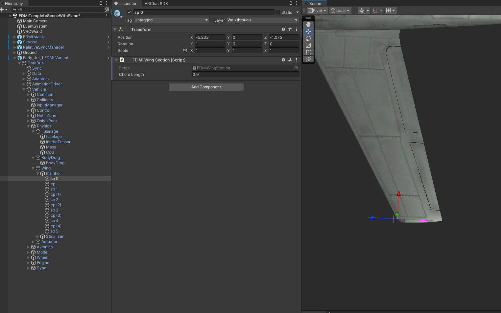
2. 二つの`FDMiWingSection`に挟まれた位置に、`FDMiwing`を配置します
  - このとき、`FDMiwing`の **Hierarchy上側** に**左側**の`FDMiWingSection`、**Hierarchy下側** に**右側の**`FDMiWingSection`が来るように配置します。
  - 配置したら、`SectionL`と`SectionR`の横 **Meybe** ボタンを押します。
  - 次に**Setup This**ボタンを押します。
  - ここまでで、**Y軸が翼の上側**に来ていることを確認します。
  - 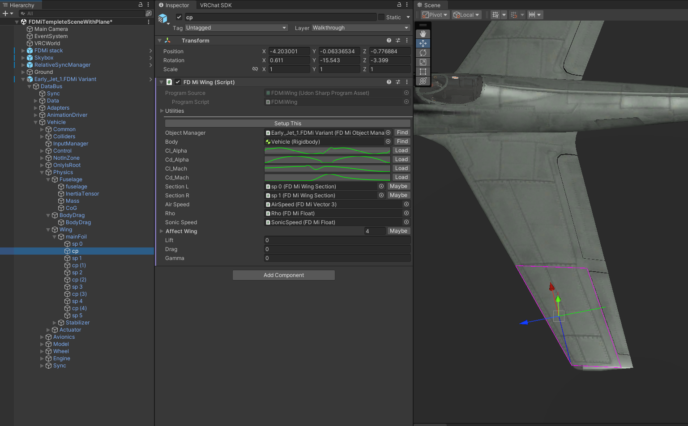
3. 以下の翼特性を入力します
  - `Cl_Alpha`,`Cd_Alpha`: 翼の迎角(空気の流れと翼の角度差)に応じた揚力/抗力の出方をチューニングします。
  - `Cl_Mach`,`Cd_Mach`：翼のマッハ数に応じた揚力/抗力の出方をチューニングします。サンプル機の値でまず試します。
  - `affected wing` : 現在バグがあるので、埋めなくて大丈夫です。（Maybeを押して埋めても影響小。放置で良い）
4. 1~3を繰り返し、翼の形を作成します。
5. 最後に、上部`FDMi/Setup All`を押します。

:::danger
`FDMiwing`のコンポーネントが増加した際には、必ず`FDMi/Setup All`を実行してください。  
翼が機体に登録されず、Exceptionが発生します。
:::

:::tip
Cl-Alpha, Cd-Alphaは特にこだわりなき場合、サンプル機の数字で良いと思います。
ただし、戦闘機やアクロバット機のときは、主翼も尾翼の値で設定してあげます。
:::

:::tip
そのままだとほとんどの機体が翼端失速を起こすので、翼の左右の端の`FDMiWingSection`に、ねじり下げ（Z軸が少し下を向くくらい？）を設定してください。  
この挙動はバグで、修正予定です。(本来`affected wing`で計算する箇所だった)
:::

## 5. 尾翼

次に、尾翼を設定します。主翼と同様に、尾翼の形を設定します。

:::tip
垂直尾翼のSectionL,SectionRの上下関係は、どちらでも大丈夫です。
:::

尾翼の考え方ですが、２通りあります。どちらでも構いません。
- 尾翼が「全体の舵の何％か」⇒「尾翼全体が何°回ったことに相当するか」で計算
    - 参考: https://mtkbirdman.com/tail-detail-design 「舵面サイズの決定」
- 尾翼舵面と固定部を分けて、舵面のみ回転させる

ここで、尾翼の舵を設定します。
尾翼舵は、**Transformを回転**させて行います。以下のどちらでも構いません。

- 機体のボーンに連動させる
- `FDMiWing`の親にコンポーネントを配置し、回転させる

今回は後者で設定を行います。
サンプル機の通り、`FDMiwing`の親にTransformを設定し、`FDMiwing`の回転軸に合わせるように配置します。

 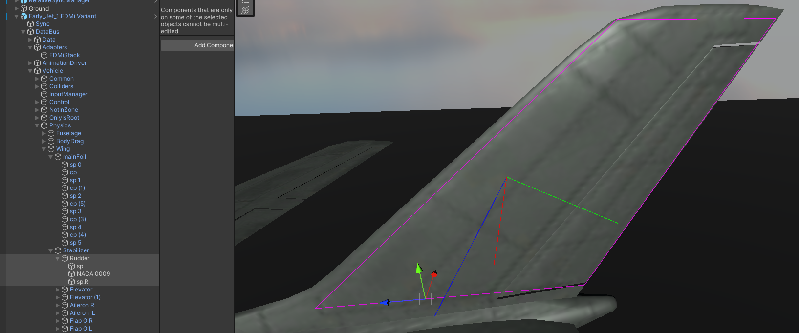

## 6. 機体重量・重心・モーメント

ここで、機体重量・重心・モーメントを設定します。
サンプル機の通り、`FDMiFuselage`を`Databus/Vehicle/Physics/fuselage`に配置します。
※ パイロットのみが計算を担当するよう、`FDMiObjectActivateIsPilot`の子に配置してください。通常`Databus/Vehicle/Physics`の子に配置します。

#### 機体重量

`FDMiFuselage`の`Override Mass`を有効化（☑）すると、Rigidbody.Massを`Mass.data`の値に上書きします。

#### 慣性モーメント
機体の”回転の重さ”です。  
`FDMiFuselage`の`Override Inertia`を有効化（☑）すると、Rigidbody.inertiaTensorを`InertiaTensor.data`の値に上書きします。  
ここは、詳しくない場合は無効化してください。その場合、Unityのコライダーの大きさで、回転の重さを調整してください。

:::tip
慣性モーメントは、現実にある類似機の代表値を入れて、操舵が重たい場合は減らしていく形で調整してください。
(Cessna 172, B737, F-16あたりの値で試すことをお勧めします)
:::

#### 重心
`FDMiFuselage`の`Override Cog`を有効化（☑）すると、Rigidbody.centerOfMassを`CoG.data`の値に上書きします。 
`CoG`の`Vector3`の値を設定します。Transformをずらして、いい感じになった所の**Rigidbodyの位置からの距離**を、`CoG.data`に入れます。

 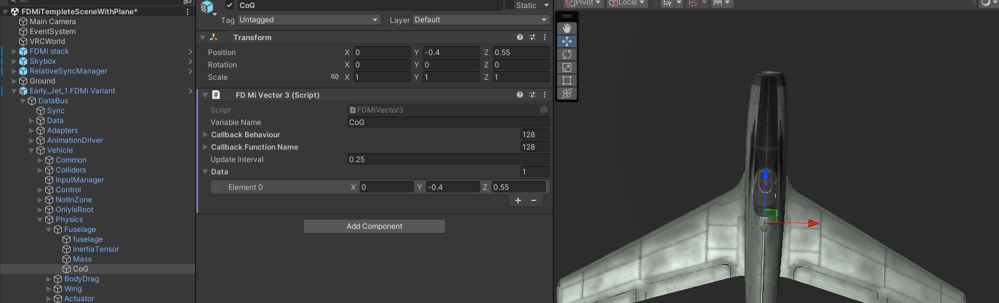

:::note
基本的に、重心は以下の制約を満たして下さい。
- 前後のギアの中間のどこか
- 翼の生えている位置の、中ほどから前半あたり

操縦特性が重たい時は重心を後ろより、軽いときは前よりにしてみてください。
重心位置と翼の配置が正しければそれなりに飛ぶはずです。
:::

## 7. 胴体抵抗

胴体抵抗の設定を行います。  `FDMiDragBody`を`Databus/Vehicle/Physics/bodyDrag`に配置します。
※ パイロットのみが計算を担当するよう、`FDMiObjectActivateIsPilot`の子に配置してください。通常`Databus/Vehicle/Physics`の子に配置します。

- `D`,`L`を調節し、機体と、黄色いカプセルコライダーの大きさが大体同じになるように調節してください。
- Transformの中心位置は重心付近に配置します。

 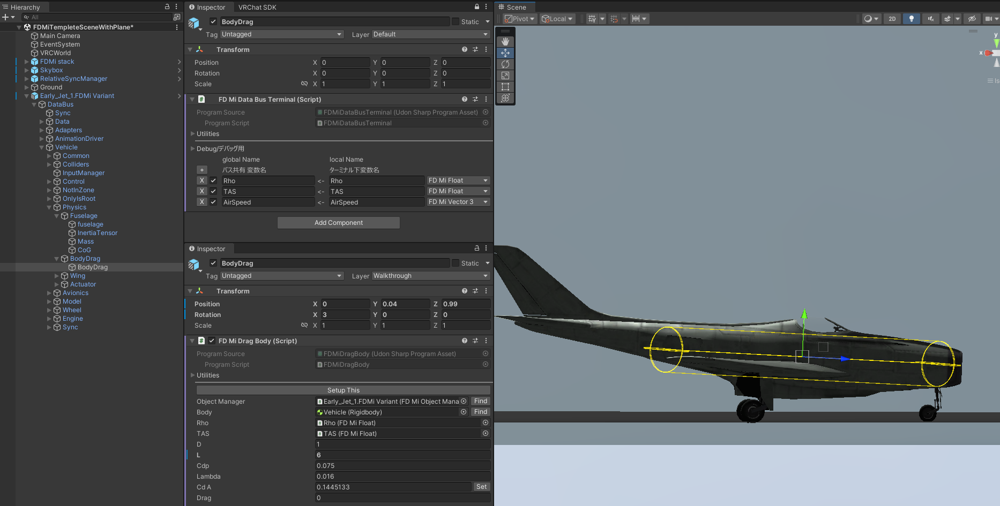

:::note
現状、胴体抵抗の計算が間違っています。調整は適当程度で済ませてください。
:::

## 8. 操縦系

最後に、操縦系の設定を行います。
操縦系は、以下のように伝達します。

1. パイロットの入力やオートパイロットが操舵量を出力します。
2. 操舵量を`FDMiFloatMixer`等で混ぜ合わせ、各舵の操舵量(通常　-1~1)を作成します。
3. 翼に操舵量に対する効果を適用します。

※※ TODO （操縦系の概念図）　※※

### 操縦量の混ぜ合わせ

操縦量の混ぜ合わせは`Databus/Vehicle/Control`で行います。
`FDMiFloatMixer`を設定します。

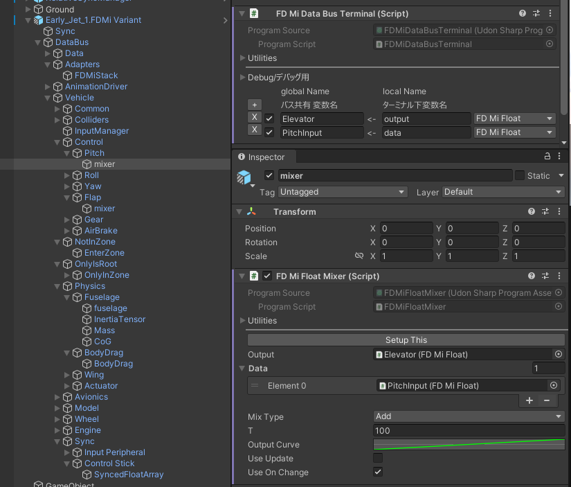

:::tip
ここで作成した`FDMiFloat`の値を、舵面のアニメーションに適用することを推奨します。
:::

### 操縦系の翼への適用

操縦系の適用は、２種類に分けて考えます
- 翼の角度変化(Transformの回転で達成)
- 翼への効果(Cl,Cdへの単純倍)

※ パイロットのみが計算を担当するよう、`FDMiObjectActivateIsPilot`の子に配置してください。通常`Databus/Vehicle/Physics`の子に配置します。  
今回は`Databus/Vehicle/Physics/Actuator`に配置しています。

#### 翼の角度変化

`FDMiTransformRotationDriver`を用い、翼のTransformを回転させます。
`multiplier`に、操舵量に対する舵の回転量を入力します。

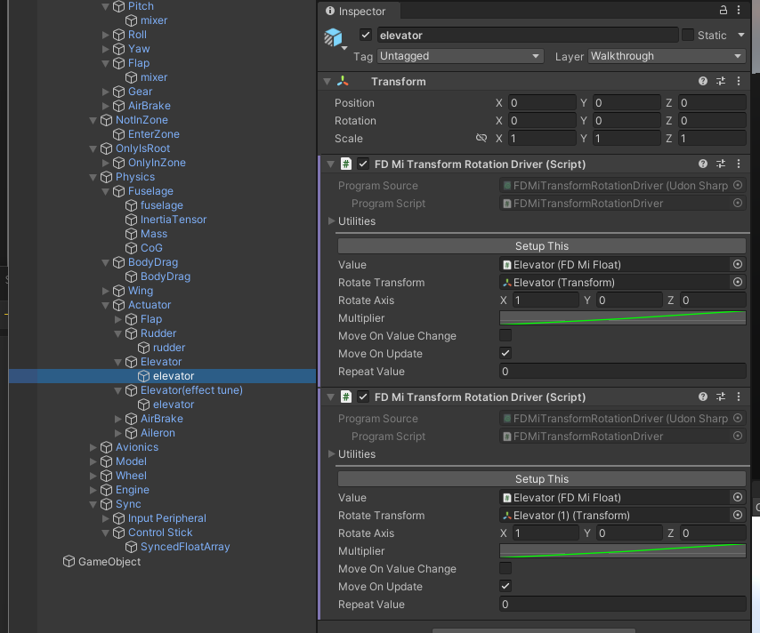

#### 翼への効果

`FDMiWingExtendActuator`を用います。
Multiplyに、操舵量に対する揚力/抗力の増加倍数を入力します。

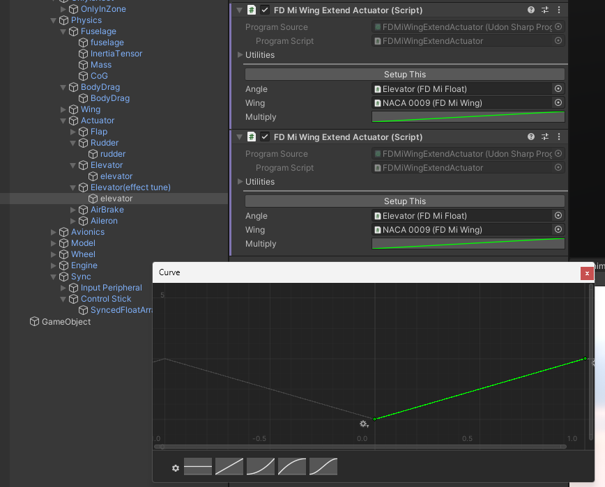